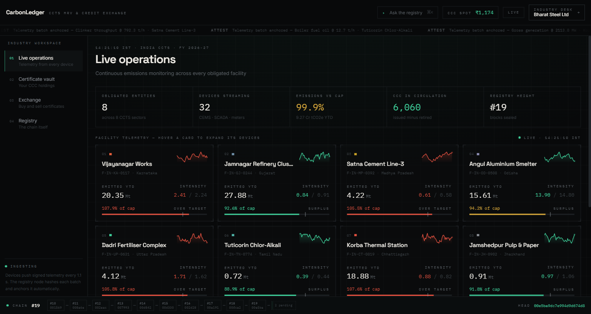
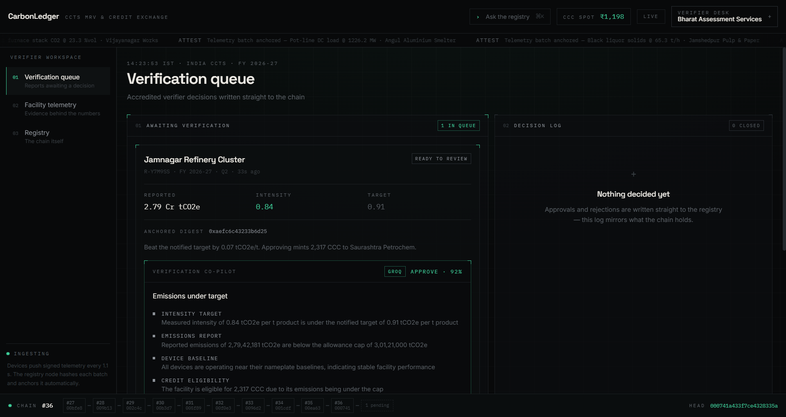
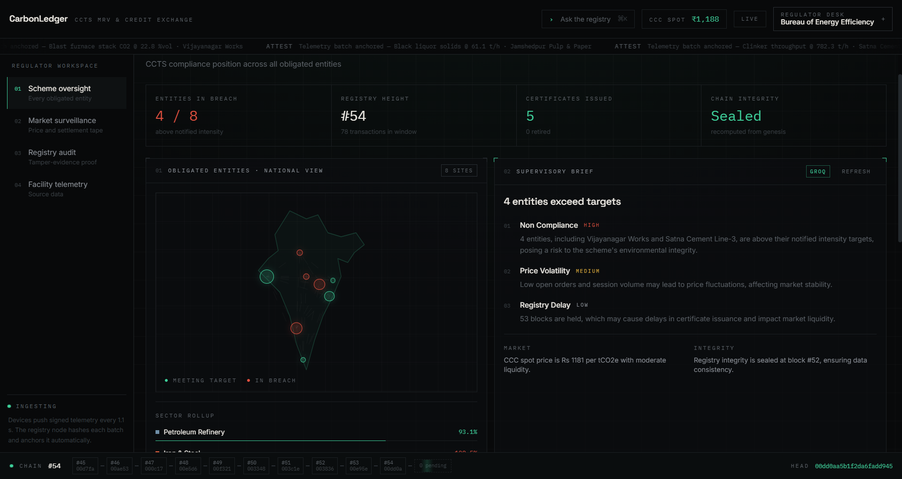
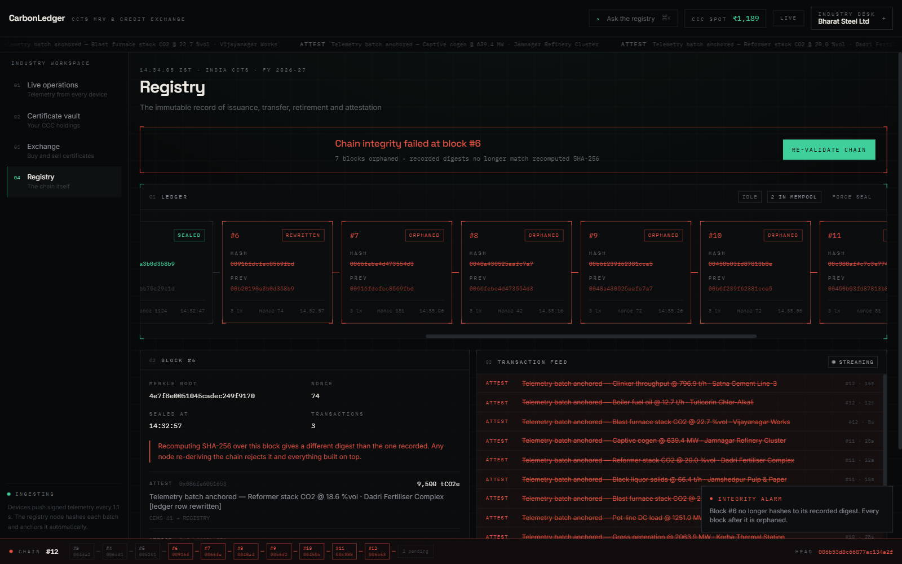
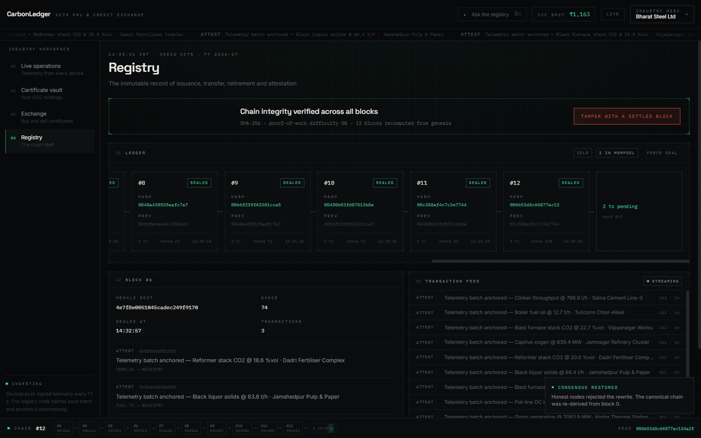
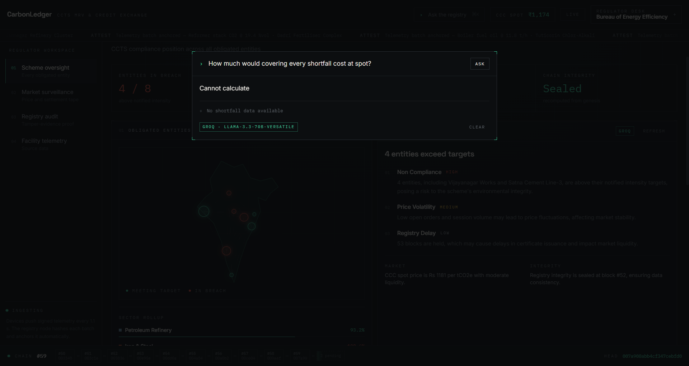

# CarbonLedger

**A blockchain-based Carbon Credit Marketplace & MRV platform for India's Carbon Credit Trading Scheme (CCTS).**

CarbonLedger unifies emissions monitoring, reporting and verification (MRV), tamper-evident credit issuance, and on-chain trading into a single live registry — replacing the fragmented, manual, spreadsheet-driven compliance workflow that obligated industries, accredited verifiers and the regulator currently rely on.



---

## What it does

Three roles share one live registry, each seeing the same state update in real time:

- **Industry** — monitors device-level emissions telemetry from every facility, files MRV reports, holds and trades Carbon Credit Certificates (CCCs).
- **Verifier** — reviews reports against live sensor evidence, gets an AI-generated recommendation before deciding, approves or rejects — decisions are written straight to the chain.
- **Regulator** — supervises every obligated entity nationwide, audits the registry's integrity, generates AI compliance briefs.

| | |
|---|---|
|  |  |
| AI co-pilot cross-checks a report against live device readings before a verifier decides | Regulator's national view — every obligated entity, sector rollups, live compliance status |

### The registry is a real hash chain, not a database with a blockchain label

Every emissions batch, MRV report, verification decision, credit issuance, trade and retirement is a transaction sealed into a block via SHA-256 + proof-of-work — implemented from scratch, no crypto library. Tampering with a settled block is demonstrable live: rewrite one record, watch its hash diverge and every block after it orphan, then re-validate and watch the chain heal.

| | |
|---|---|
|  |  |
| A rewritten block is caught instantly — every downstream block orphans | Re-validating re-derives one canonical chain from genesis |

### Ask the registry anything

A command palette (⌘K) answers natural-language questions about the live scheme — shortfalls, market exposure, chain integrity — grounded in numbers computed server-side.



---

## Architecture

```
┌─────────────────────┐        SSE  (live state push)        ┌──────────────────────┐
│   React frontend     │ ◄───────────────────────────────────│   Node registry node   │
│   (Vite, port 5199)   │ ──────────────────────────────────► │   (port 8787)           │
└─────────────────────┘        POST /api/*  (user actions)   └──────────────────────┘
                                                                        │
                                                                        ▼
                                                              ┌──────────────────┐
                                                              │  Groq (Llama 3.3)  │
                                                              │  verification,      │
                                                              │  briefs, Q&A         │
                                                              └──────────────────┘
```

The browser holds no business logic. It opens one persistent connection (`GET /api/stream`, Server-Sent Events) and renders whatever state the registry node pushes. Every user action — submit a report, approve it, trade a certificate, tamper with a block — is a `POST` to the server; the server is the only thing that mutates state, so every connected client sees the exact same registry at the exact same moment.

### Backend (`server/`)

| File | Responsibility |
|---|---|
| `chain.mjs` | Hand-written SHA-256, proof-of-work mining, Merkle roots, chain validation — zero dependencies |
| `registry.mjs` | Live simulation loop (device drift, market walk), facility/order/report state, the seed dataset |
| `ai.mjs` | Three Groq-backed routes: verification co-pilot, regulator brief, ask-the-registry — each falls back to a deterministic computed answer if the API is unreachable |
| `index.mjs` | Zero-dependency HTTP server (Node's built-in `http`), SSE stream, route table |

### Frontend (`src/`)

React 19 + TypeScript, Tailwind v4, Vite 8. One SSE subscription (`src/sim.ts`) feeds every view; role and screen are pure client-side state.

---

## Running it

```bash
npm install
npm run dev
```

That's the only command needed — `vite.config.ts` spawns the registry node as a Vite plugin the moment the dev server starts, so the frontend (`:5199`) and backend (`:8787`, proxied under `/api`) come up together. Opens automatically at **http://localhost:5199**.

### AI features (optional)

Verification co-pilot, regulator briefs, and "Ask the registry" call the [Groq API](https://console.groq.com). Copy `.env.example` to `.env` and set:

```
GROQ_API_KEY=your_key_here
GROQ_MODEL=llama-3.3-70b-versatile
PORT=8787
```

Without a key, those three features fall back to deterministic computed answers (labeled "offline" in the UI) — nothing else in the app depends on it.

---

## Demo path

1. **Live operations** — click a facility card, open its MRV report tab, submit the report.
2. **Switch to Verifier desk** — run the AI co-pilot, approve the report (mints a Carbon Credit Certificate).
3. **Exchange** — buy or sell a certificate on the live order book.
4. **Registry → Tamper with a settled block** — watch the chain detect the rewrite and orphan every block after it.
5. **Re-validate chain** — watch it heal back to one canonical chain from genesis.
6. **Regulator desk** — generate a scheme-wide AI compliance brief.

---

## What's real vs. simulated

The **mechanisms** are real and running, not mocked: the SHA-256/proof-of-work chain, the tamper-detection and re-validation, the client/server split with a single source of truth, and the Groq-backed AI calls.

The **dataset** is synthetic — there is no public BEE/CCTS API to integrate against yet, so the eight obligated facilities, their sensors, and market counterparties are hand-authored (`server/registry.mjs`, marked `// MOCK:`) but modelled on real CCTS-obligated sectors and notified intensity targets. Swapping in a real facility feed would only touch that one file.

---

## Tech stack

**Frontend** React 19 · TypeScript · Tailwind CSS v4 · Vite 8
**Backend** Node.js (`http`, zero dependencies) · Server-Sent Events
**Cryptography** Hand-written SHA-256, proof-of-work, Merkle trees
**AI** Groq API — Llama 3.3 70B

## License

MIT — see [LICENSE](LICENSE).
